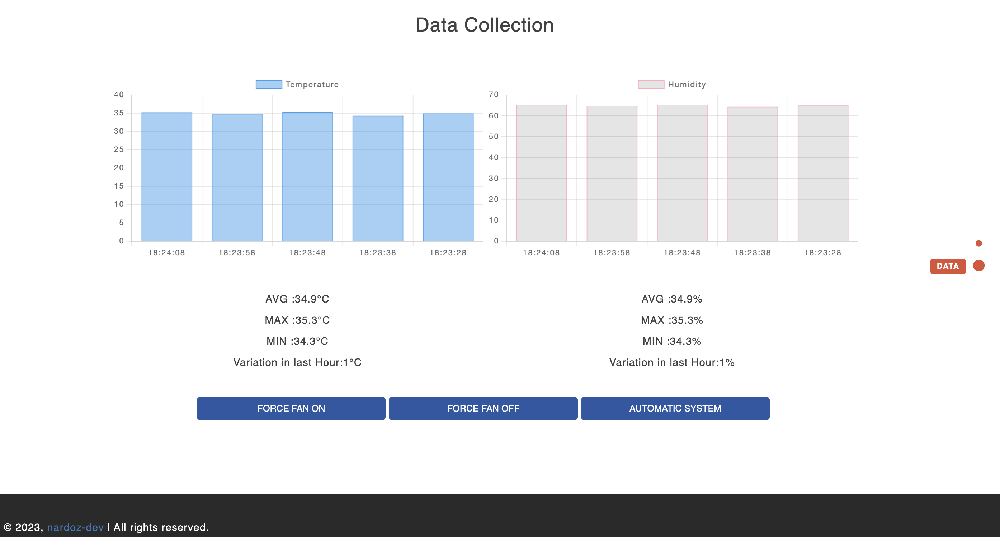

# WINDFORME 

`WINDFORME` - IoT University Project for the IoT 2022 Course @ Sapienza University of Rome.

## Member

| **Name and Surname** | **Linkedin** | **GitHub** |
| :---: | :---: | :---: |
| `Andrea Nardocci ` | [](https://www.linkedin.com/in/andrea-nardocci) | [](https://github.com/nardoz-dev) |

## Introduction

`WINDFORME` Project.

The Internet of Things (IoT) has revolutionized the way we interact with technology in our daily lives, and this project is no exception. Introducing the WINDFORME a fully automated fan system solution designed to bring comfort and convenience to your home or office. This system leverages the power of IoT to create a smart, self-regulating environment that adjusts to your changing needs. The fan system is equipped with a range of sensors and controls that work in tandem to monitor the temperature. It then uses this information to automatically adjust the speed of the fan, ensuring that you always have a comfortable and optimal indoor climate. Whether you're at home, at work, or away, this system takes care of your comfort, providing you with peace of mind and a more enjoyable indoor environment.

## Architecture Design


## Hardware

* **Board : `Nucleo f401RE`**

  The [Nucleo F401RE](https://www.st.com/en/evaluation-tools/nucleo-f401re.html) is a development board based on the STM32F401RE microcontroller. The STM32F401RE is a high-performance microcontroller from STMicroelectronics that is part of the STM32 family of 32-bit Arm Cortex-M4 microcontrollers. The board also provides access to the STM32 microcontroller's rich range of hardware peripherals, making it a suitable platform for developing a wide range of applications, such as those in the fields of Internet of Things (IoT), robotics, and other embedded systems.
  The board includes an ARM Cortex-M4 core microcontroller running at up to 84MHz with 512KB of flash memory and 96KB of RAM. It also includes a variety of peripherals, including multiple timers, communication interfaces (UART, SPI, I2C, CAN), and analog-to-digital converters.

* **Humidity Sensor : `DHT11`**

  The [DHT-11](https://www.adrirobot.it/sensore_dht11/) is a low-cost digital temperature and humidity sensor. It uses a capacitive humidity sensing element and a thermistor to measure the ambient air temperature and humidity.
  It can measure temperatures between 0 and 50 degrees Celsius, with an accuracy of ±2 degrees Celsius.
  In terms of electrical specifications, the DHT-11 sensor operates at a supply voltage of 3.3V to 5V and has a maximum current consumption of 2.5 mA.

* **7-Segment display : `5611BH`**

  A 7-segment display [5611BH](https://datasheetspdf.com/pdf/1404694/XILTX/5611BH/1), is a type of electronic display device used for displaying decimal numerals. It consists of seven individual segments, labeled A through G, that can be illuminated to form the numerals 0-9. The display has a forward voltage drop of 2.1V and a maximum forward current of 20mA for each segment.

* **Motor : `Mabuchi FC-130RA/SA`**

  The [FC-130RA](https://www.neuhold-elektronik.at/datenblatt/fc_130rasa.pdf) is a small DC motor. It is a brushed motor, meaning it uses a system of brushes to transfer electrical energy to the motor's rotor, which then converts this energy into mechanical rotation.
  The FC-130RA/SA motor has a nominal voltage of 3V and can operate in a range of 1.5V to 4.5V. It has a no-load speed of 12,500 RPM and can produce a maximum torque of 7.4 g-cm. The motor has a maximum efficiency of 70% and a maximum power output of 1.2 W.


* **Transistor : `2N3904`**

  The [2N3904](https://www.onsemi.com/pdf/datasheet/2n3903-d.pdf) is a small signal NPN bipolar junction transistor that can be used to control a flow of electric current in which a small amount of current in the base conductor controls a larger current between collector and emitter. They can be used to amplify a weak signal, like a switch. In normal state, 2N3904 acts as reverse biased and there's no conduction between Collector & Emitter. When small voltage applies at its Base Terminal(normally 5V), 2N3904 converts its state from reverse to forward biased and conventional current starts flowing from Collector to Emitter.
  The transistor has a maximum collector current of 200 mA, a maximum collector-emitter voltage of 40 V, and a maximum power dissipation of 625 mW. 


## Software


* ### RIOT OS

  RIOT powers the Internet of Things like Linux powers the Internet. RIOT is an open-source microkernel-based operating system, designed to match the requirements of Internet of Things (IoT) devices and other embedded devices. These requirements include a very low memory footprint (on the order of a few kilobytes), high energy efficiency, real-time capabilities, support most low-power IoT devices, microcontroller architectures (32-bit, 16-bit, 8-bit), and external devices. RIOT aims to implement all relevant open standards supporting an Internet of Things that is connected, secure, durable & privacy-friendly.

  A good high-level overview can be found in the article [RIOT: An Open Source Operating System for Low-End Embedded Devices in the IoT](https://www.riot-os.org/assets/pdfs/riot-ieeeiotjournal-2018.pdf) (IEEE Internet of Things Journal, December 2018).

## Network 

The following image represents a description of the entire network system that we can find within the project.


* **Board**  
  RIOT provides the ethos_uhcpd tool to provide network connectivity to an MCU via the USB connection. In the case of the STM32 Nucleo-64 F401RE this is very useful as the development board does not provide a wireless network interface.
  The ethos_uhcpd tool builds on top of the serial interface, ethos (Ethernet Over Serial) and UHCP (micro Host Configuration Protocol). Ethos multiplexes serial data to separate ethernet packets from shell commands. The ethos_uhcpd tool will provide network connectivity through the TAP interface. After all connection , the board send messages through the MQTT protocol.
  
* **Protocol**  
  MQTT is a lightweight and flexible network protocol that uses a central message broker to coordinate communication among the peers of the network. Peers can interact with the broker by sending and receiving messages within specific topis. By organizing message exchanges into topics, devices can exchange data or commands with each other or in a group. This structure can allow the application developer to set up a hierarchy of devices with complex controlling schemes.

* **Mosquitto.rsmb**  
  Then the board is connected to mosquitto.rsmb : the Really Small Message Broker is a server implementation of the MQTT and MQTT-SN protocols. Any client that implements this protocol properly can use this server for sending and receiving messages.

* **Transparent Bridge**  
  A transparent bridge written in python that works as a bridge exchanging messages using MQTT between broker (In our case the broker : are the "board" and the AwS IoT Core). It reads messages from the local broker with "topic_data" and publishes them to AWS IoTCore on the same topic. It also reads messages from AWS IoT Core with "topic_board" and publishes them on the local broker with the same topic.

* **AwS Services**  
  This is the cloud part. Once the data arrives to AwS IoT Core, it will be processed and store on AWS Services : DynamoDB. Then are available some Lambda function that are invoked from the WebApp.
    
  This process varies from user to user, in our case we set up our rules, our iam, all this in order to grant specific permissions for different AwS services.

  AwS Amplify then is used to host our application. The User Interface is fully understandable, and it display and monitor the temperature and humidity data. It can also display some measurements that we make in order to be able to have an overview of the trend of the data collected by the sensor, such as average, maximum, minimum and variation. Futhermore from our web application we can send special commands to the board.

This is how the web application looks like.
||
|:--:|
||

## Working Principle

This IoT system plays the role of monitoring temperatures and humidity ***(with the DHT11 sensor )*** and then triggers a cooling system if the temperature exceeds the threshold temperature. In addition, there is a 7-segment display ***(5611BH)*** which indicates the status of the cooling system, which consists of a motor ***(mabuchi FC-130 RA/SA)*** and a fan. The status is indicated with 0 if the fan is off, 1 if the fan is on, and 2 if the fan has received an external command that has changed system modes.

The system has three system modes, 0 : AUTO , 1 : ON , 2 : OFF , where they indicate respectively : system in automatic mode, system always on, system always off. They refer to the operation of the cooling engine, also , can be set by the user remotely through the user interface provided in the web application.
The board during the first startup, is initialized with the system in automatic mode. The automatic mode consists of performing computational calculations on the data read from the sensors, i.e. we check whether the temperature read from the sensor is greater than the threshold temperature, if it is the case the cooling motor is triggered. This is achieve by the activation of the GPIO pin linked to the base of transistor, in this way the transistor ***(2N3904)*** allows current flow into the motor. Timers and flags have been added to ensure that the engine start procedure, like the shutdown procedure do not cause interference with the system and are not repeated in case the same condition is regenerated repeatedly. 
The ON mode, always keeps the engine running, vice versa for the OFF mode, however, both ensure the sensor data is read and sent to allow the user to monitor the data from the graphs in the web app.

The polling and 'sending of data from the board into the cloud was decided to make it periodic with an interval of about 10 seconds. This avoids an aggregation of the data being sent, preventing any traffic congestion. In addition, much of the computation is done at the edge level, avoiding high latency when sending data to the cloud, all because the board can support computation. In this way, the only thing we send to the cloud is a message containing the temperature and humidity. 

## Network 


### General Description

Data management and sending within this project is done using the MQTT protocol. We have the board connected to the mosquitto.rsmb server and our AwS IoTCore service which are connected through a transparent bridge that we wrote in python. We therefore have our mqtt broker which we have subscribed to the "topic_data" topic and our AwS IoTCore broker which is instead subscribed to the "topic_board" topic.

The board builds the information to send and publishes it on the topic: *topic_data*, the transparent bridge captures this message and sends it by invoking a lambda function on a topic to which we have subscribed the AwSIoTCore and then save it on a table in DynamoDB .
An important aspect of this operation is the Policy that we associate with our object in AwSIoTCore, here is an [example of policy](/IoTCore_thing/windforme-Policy).

Two-way communication has been implemented, so from our web application we can communicate with the board.
For the moment the only functionality that has been implemented is the sending of a message that changes the system mode of the entire application. The message generated by the web application is published through a lambda function on the topic: *topic_board* . The transparent bridge is activated to carry the message published on the broker of the board, in order to trigger the callback function of the mqtt protocol.  The message is then processed in order to extract the command to be executed.

Another important aspect is the assignment of IAM Policy for lambda functions, which depending on the type of service they offer need permissions.

Also, it is possible to trigger from the WebApplication the synchronization of information retrieval whenever the board sends a message to the database. This clamping was handled by taking into account the latencies that the message undergoes in sending and receiving.

### Network performance

Via a tool for analyze packets in the network is possible to see how are our packets.In our network there will be transmitted only the temperature and humidity data, futhermore from the webapp in the board will be transmitted only a message with special words for system command.

So in the first case we have a message that is lees than 37bytes. In the second case in the worst case since we need to send one of [ auto - on - off ] his length is maximum 5bytes . In both cases we have a very short latency, one caused from when the sensor register a new value and the other one from when a button is clicked on the web app to when the system acts. This latency are short enough to not affect the usability of the system.

## Data Processing

### Edge Computing

Then there are two process that are running fully on the device itself : 
* the process of the automatic system which need to compare the value read from the sensor with the threshold.
* trigger logic of the motor - once is received the message command from the webapp.  

In this way the network latency does not influence the capability of the device.

### Cloud Computing

The only part that works on cloud , so in the specific on AWS. It recieves the temperature and humidity data from the devices and then are stored on DynamoDB. The following rule manages the execution flow of this operation.


## Setup & Run 

### Configuration AWS Environment
* **AWS IoTCore**.  
  You need to setup a thing on this services then you need to download some certification, they need to look like the ones that are in IoTCore_thing folder. The most important thing is the Policy, in order to use this project you should have a Policy like [windforme-Policy](/IoTCore_thing/windforme-Policy).  
  Then you need to construct a messagging rules like the one described before in the cloudcomputing part in order to write in the dynamodb table the data received from the board.
* **Lambda function**.  
  Write two lambda functions such as [publish_to_iotcore](/LambdaFunctions/publish_to_iotcore.py) and [read_data](/LambdaFunctions/read_data.py).  
  If they are created on aws lambda, pay attention to the role, you probably need to use the IAM management console to customize them. 
  In fact, for the first lambda function, I applied the AWSIoTFullAccess policy to the specific associated role, then for the second lambda function, however, I modified the policy already attached to the associated role and added write permission on dynamodb services.
* **DynamoDB**.  
  Simply creates a table called "your_table_name," the name of which must be the same as written in the read_data lambda function.
* **AWSAmplify** ***not strictly necessary***.  
  You can hosts the entire webApp folder on the AWSAmplify service. 
  By the way, you can test the application on localhost.

### Mosquitto RSMB
* Download [mosquitto rsmb](!https://github.com/eclipse/mosquitto.rsmb).  
  ``` 
    cd mosquitto.rsmb/rsmb/src
    make
  ```
* Create a file ```whatever_name.conf``` . In this case we run the RSMB as MQTT and MQTT-SN capable broker, using port 1885 for MQTT-SN and 1886 for MQTT and enabling IPv6,  so we need to write this inside the whatever_name.conf file.
  ```
    # add some debug output
    trace_output protocol

    # listen for MQTT-SN traffic on UDP port 1885
    listener 1885 INADDR_ANY mqtts
    ipv6 true

    # listen to MQTT connections on tcp port 1886
    listener 1886 INADDR_ANY
    ipv6 true
  ```
* Start it.
  ```
    ./broker_mqtt whatever_name.conf
  ```
### Transparent bridge
* Go under the folder of bridge then install dependencies: 
  ```
    pip3 install -r requirements.txt
  ```
* Start transparent bridge.
  ```
    python3 transparent_bridge.py
  ```

### Flash the board

* You can launch directly the application by starting the script [start.sh](!/start.sh).  
  This script is very important, as it will set interfaces and global ip for the operation of the rsmb mosquitto server.
  You need to launch with sudo privilegies.
  ```
    sudo ./start.sh
  ```
## BlogPost
You can read more specific information in this [blog post](https://www.hackster.io/nardomen96/automatic-ventilation-system-6d643e). 

## Demo video
Videodemo presentation of project, [link here](https://www.youtube.com/watch?v=rtMJEa1l2h4). 


 
